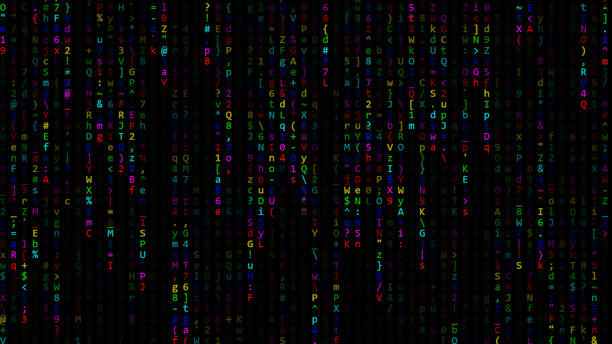

# ▶️Demo

# ℹUsage
You can [go to the website](https://Rudxain.github.io/RGB-digital-rain) to see the animation on any device, or [⬇download](https://github.com/Rudxain/RGB-digital-rain/archive/refs/heads/main.zip) this repo as a .zip file. If you downloaded the zip, then extract it. Open `index.html` in your 🌐browser of choice (it also works on Chrome for Android!), and enjoy the real-time animation!

# Naming?
If you don't believe me, the "official" name is ["Digital Rain"](https://en.wikipedia.org/wiki/Matrix_digital_rain), even though the standard-de-facto is "falling code".

# ⭐Credits
1. Original source code by 👤Ganesh Prasad: https://codepen.io/gnsp/pen/vYBQZJm
2. My family member for sending me the article.
3. Inspiration by [RGB PC setups](https://redtech.lk/file/2020/01/Omega_3.png). [This one](https://reddit.com/r/pcmasterrace/comments/rhzb6i/i_built_an_rgb_side_panel_with_the_matrix_digital) looks similar to my animation.

# 📝To-Do
* Make it interactive (how?).
* Add a developer/debug mode that "unlocks" constants. I'll implement it by conditionally executing code based on the content of [`location.href`](https://developer.mozilla.org/en-US/docs/Web/API/Location/href).
* Replace JS by TypeScript in anim.js (convert to anim.ts to take advantage of TS features).
* Make the GitHub Pages site use a minified version of the source files.
* Use vector graphics instead of a bitmap
