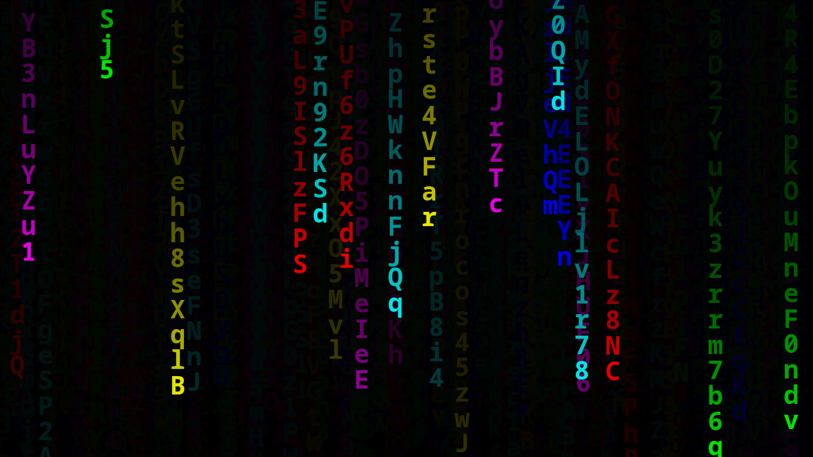

# RGB-DR

## ▶️Demo

## ⚙️Features
- ⚡️Efficient: GPU-accelerated rendering (WIP)
- 👆Interactive: droplet spawning on 🖱click/touch
- Real-time auto 🔆light/🌙dark theme switching, with _transitioning_ ✨️
- 💻Responsive: efficient resizing, and native full-screen resolution

## ℹUsage
This `gl` branch is for switching to `WebGL` API. Code will be broken while I rewrite it.

## Naming?
If you don't believe me, the "official" name is ["Digital Rain"](https://en.wikipedia.org/wiki/Matrix_digital_rain), even though the standard-de-facto is "falling code".

## Why I did this
Everything started when a family member (I haven't asked permission to reveal their identity, yet) sent me a link to [this article](https://dev.to/gnsp/making-the-matrix-effect-in-javascript-din), and I was interested in learning how it worked, because the code was so simple yet the result was so cool and complete! I also wanted to learn because I always wanted to make a canvas/image processing in some programming lang, specially if it involved animations.

I downloaded the source, started editing in [VS-Code](https://en.wikipedia.org/wiki/Visual_Studio_Code) to make some minor improvements, and realized I could update the font color for each individual char being displayed, so I decided to implement the feature using a color table sorted like a *🌈rainbow* (like those [RGB gaming PC setups](https://redtech.lk/file/2020/01/Omega_3.png), lol). I searched on the web to see if someone has done the exact same thing and only found [this video](https://youtu.be/CccQcYzsvI4), which is similar but not the *same* idea, because it has a limited color palette (update: found [this app](https://play.google.com/store/apps/details?id=com.screensavers_store.matrixlivewallpaper)). So I decided to post my little project on GH for anyone to see and give me feedback.

Later I realized GH allowed anyone to create web{page/site}s, so I started setting everything up, while also breaking my head trying to understand exactly what I had to do, lol. Some parts of the docs said I had to **install 3 different packages**, other parts told me to do other things. But in the end I realized it was much simpler than I thought.

## ⭐Credits
0. Original source code by 👤Ganesh Prasad: https://codepen.io/gnsp/pen/vYBQZJm
1. My family member for sending me the article.
2. Inspiration by RGB PC setups like [this one](https://reddit.com/r/pcmasterrace/comments/rhzb6i/i_built_an_rgb_side_panel_with_the_matrix_digital) which looks similar to my animation.
